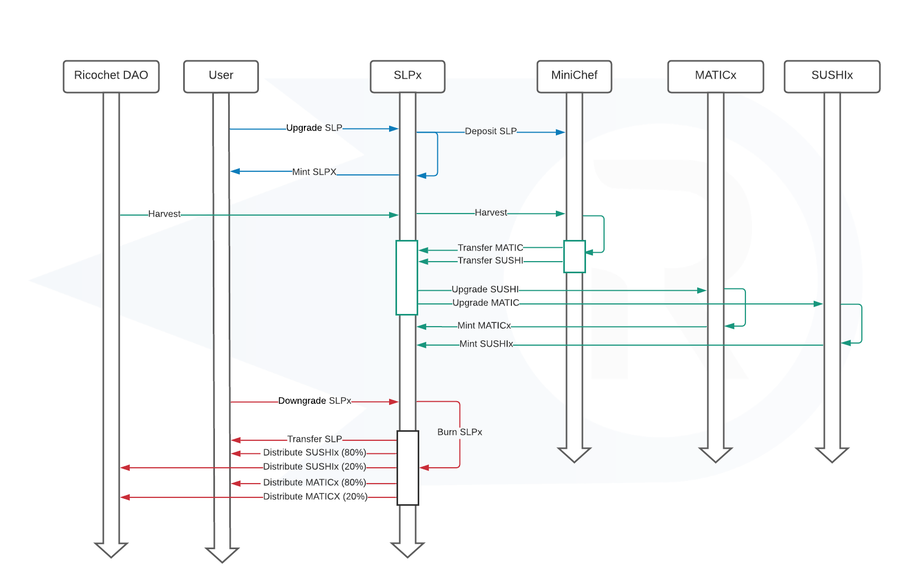

# Ricochet Super SLP tokens (SLPx)
This project creates streamable SushiSwap LP tokens. These tokens can be used in Ricochet Exchange's DCA system and they support earning SUSHI and MATIC subsidies.

## Contract Architecture

### Overview
* SLPx tokens are wrapped SushiSwap LP tokens
* **Upgrade:** SLP tokens are deposited into the `MiniChef` contract to earn SUSHI and MATIC
* **Harvest:** SLPx tokens have a `harvest` function that harvests the SUSHI/MATIC subsidies from `MiniChef` and wraps them as SUSHIx/MATICx
* **Downgrade:** SLPx tokens are burned, SLP tokens are returned to the user, and any accumulated SUSHIx/MATICx is distributed using Superfluid's `InstantDistributionAgreement`
### Inheritance
* SLPx inherits from Superfluid's `SuperToken`
* SLPx overrides the functionality of `upgrade` and `downgrade` methods on `SuperToken`
### Data Structures
* `address lpTokenAddress` - The address of the LP token to use
* `address maticxAddress` - The address of the `MATICx` contract
* `address sushixAddress` - The address of the `SUSHIx` contract
* `address miniChefAddress` - The address of the `MiniChef` contract
* `uint256 pid` - The pool ID to use for `MiniChef` deposit and harvest function calls
### Methods
#### Overrides
**upgrade(uint256 amount)**
* Parameters
  * `amount` - the amount of SLP tokens to upgrade
* Pre-conditions
  * `msg.sender` has approved `SLPx` contract to spend their SLP
  * `SLPx` contract has approved `MiniChef` to transfer SLP tokens
* Post-conditions
  * SLP tokens are transferred to `SLPx` contract
  * Transferred SLP tokens are deposited into `MiniChef`
  * `SLPx` tokens are minted to `msg.sender`
* :information_source: Also need to override `upgradeTo` method

**downgrade(uint256 amount)**
* Parameters
  * `amount` - the amount of SLP tokens to downgrade
* Pre-conditions
  * `SLPx` contract has approved `MiniChef` to transfer SLP tokens
* Post-conditions
  * Call `harvest` method (not shown in arch. diagram)
  * SLPx tokens are burned
  * SLP tokens are transfered to `msg.sender`
  * SUSHIx is distributed using an IDA to the `SLPx` holders
  * MATICx is distributed using an IDA to the `SLPx` holders

**harvest()**
* Parameters
  * None
* Pre-conditions
  * None
* Post-conditions
  * Calls `harvest` on `Minichef`
  * Upgrade MATIC and SUSHI received from `MiniChef`

end
