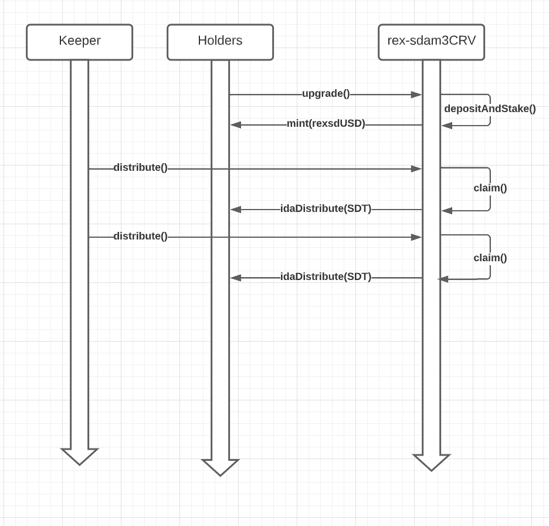
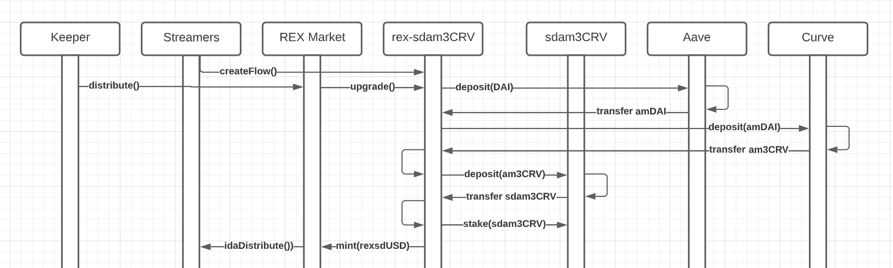

# Ricochet's Auto-Farming StakeDAO Token Series
This document details the integration between StakeDAO's strategy tokens and LP farming with Ricochet Exchange.

# Symbol
- sdam3CRVrex

# Table of Contents
1. [Features](#features)
2. [Customer Use Case](#customer-use-cases)
3. [Contract Interactions](#contract-interactions)
    1. [Holder Interactions](#holder-interactions)
    2. [Streamer Interactions](#streamer-interactions)
4. [Modifications](#modifications)
5. [SuperToken Modifications](#superToken-modifications)
6. [REX Market Modifications](#rex-market-modifications)

# Features
* Supports automatic rewards tokens distributions, auto-farming where the holder receives IDA distributions of the reward token, SDTx.
* One-way streaming support, USDC>>sdam3CRVrex
* NOT streamable themselves, only distributed by a REX Market, the market is the token's owner

# Customer Use Cases
- **Holder**: Holding sdam3CRVrex means your underlying stablecoins earn Aave yields plus CRV trading fees and CRV rewards. The REX token auto-farms the SDT rewards provided by StakeDAO. Holders earn yield and receive and inbound IDA distribution of SDT tokens. Inbound SDT tokens can be redirected into REX Markets to exchange for other tokens (e.g. SDT > USDC > WBTC).
- **Streamer**: Customers with inbound USDC/DAI salary streams can redirect these into sdam3CRVrex to immediately start earning yield and SDT rewards on their deposits. The USDC>>sdam3CRVrex market offers alpha by getting your salary stream into a yield bearing product immediately.

# Contract Interactions

## Holder Interactions
Holders just upgrade the token to begin receiving SDT instant distributions.


## Streamer Interactions
Streamers that open streams to USDC/DAI>>sdam3CRVrex first have all their IDA shares from the REX token allocated to the REX Market and their existing balance is added to a separate IDA pool within the REX Market for distributing SDT tokens (not shown).


## REX Market Modifications

# Modifications
This section details the modifications needed to REX Token and REX Markets to make this work.

## SuperToken Modifications
In addition to modifying `SuperfluidToken` there are also modifications to `SuperToken`. The `REXToken` implements the logic that manages distributing the token and depositing/withdrawing tokens from rewards pools (e.g. Sushi Farms).

### Structures

```
struct sdam3CRVrex {
  ISuperfluid host;
  IInstantDistributionAgreementV1 ida;
  ISuperToken inputToken;
  IStakeDAOController sdam3CRV;
  ILendingPool lendingPool;
  IMasterChef masterChef;
  ISuperToken sdtx;
  address owner;
}
```

### Underlying Token
The underlying token will be the `sdam3CRVrex` and will use a storage and helper library to hold the functionality needed:
```
contract REXStakeDAOMarket {
    using REXStakeDAOTokenStorage for REXStakeDAOTokenStorage.sdam3CRVrex;
    using REXStakeDAOTokenHelper for REXStakeDAOTokenStorage.sdam3CRVrex;

    REXStakeDAOTokenStorage.sdam3CRVrex internal underlyingToken;

    //...
}
```

### Underlying Token Setup
Since there's some setup for the underlying token, and since there's usually several underlying tokens (e.g. sdam3CRV and sdamETH share the same interface) there's an initialize. For the SLPx example, where theyre are several LP tokens that are farmable (e.g. MATIC-DAI SLP, ETH-DAI SLP share the same interface):
```
function setStakeDAOToken(
    ISuperToken inputToken,               // e.g. USDCx
    IInstantDistributionAgreementV1 ida,
    ICurveAavePool curvePool,             // converts USDC->sdam3CRV
                                          // 0x445fe580ef8d70ff569ab36e80c647af338db351
    IStakeDAOController sdamToken,        // converts am3CRV->sdam3CRV
                                          // 0x7d60f21072b585351dfd5e8b17109458d97ec120
    IMasterChef masterChef,               // Stake here for SDT rewards
                                          // 0x68456b298c230415e2de7ad4897a79ee3f1a965a
)
 external
{
    underlyingToken.host = host;
    underlyingToken.ida = ida;
    underlyingToken.inputToken;
    underlyingToken.curvePool = curvePool;
    underlyingToken.sdamToken = sdamToken;
    underlyingToken.masterChef = masterChef;
    underlyingToken.sdtx = SDTX_TOKEN;
    underlyingToken.owner = owner();
}
```
* Deposit Flow: inputToken --> curvePool --> sdamToken --> masterChef

### Harvest Method
This method exists in the `REXStakeDAOTokenHelper` libraries and is callable on the token:
```
// In REXToken.sol

function harvest() external {
  sdamToken.harvest();
}
```
The `harvest` method contains the logi around claiming and distributing rewards. There is also a `distribute` method that does the distribution using an IDA pool.
```

@dev IDA Distribute individual tokens (index 0 is the sdt token)
function distribute(REXStakeDAOTokenStorage.sdam3CRVrex self, uint32 index, ISuperToken token) public {
  _idaDistribute(self, index, uint128(token.balanceOf(address(this))), token);
}

function harvest(REXStakeDAOTokenStorage.sdam3CRVrex self) public {

  // Try to harvest from minichef, catch and continue iff there's no subsidy
  try self.miniChef.harvest(self.pid, address(this)) {
  } catch Error(string memory reason) {
    require(keccak256(bytes(reason)) == keccak256(bytes("BoringERC20: Transfer failed")), "!boringERC20Error");
  }

  // Distribute rewards IFF there are rewards to distribute
  uint256 sdts = IERC20(self.sdtx.getUnderlyingToken()).balanceOf(address(this));
  if (sdts > 0) {
    self.sdtx.upgrade(sdts);
  }

  // Distribute rewards IFF there are rewards to distribute
  if (self.sdtx.balanceOf(address(this)) > 0) {
    distribute(self, 0, self.sdtx);
  }

}
```
### Upgrade/Downgrade Modifications

Inside the `REXStakeDAOTokenHelper` the upgrade and downgrade methods manage the deposit/withdraw and claim for the underlying staked LP tokens:
```
function upgrade(REXTokenStorage.SLPx storage self, uint256 amount) public  {
  // Havest and distribute SUSHI rewards if there's any pending
  if (self.miniChef.pendingSushi(self.pid, address(this)) > 0) {
    harvest(self);
  }

  self.masterChef.deposit(self.pid, amount, address(this));
  // Update the callers IDA shares
  (bool exist,
   bool approved,
   uint128 units,
   uint256 pendingDistribution) = _getIDAShares(self, 0, self.sdtx, msg.sender);
  _updateSubscription(self, 0, msg.sender, units + uint128(amount), self.sdtx);


  // Update the owners IDA shares
  uint128 totalUnitsApproved;
  uint128 totalUnitsPending;
  (,,totalUnitsApproved,totalUnitsPending) = _getIDAShares(self, 0, self.sdtx);
  totalUnitsApproved = uint128(1000000) * (totalUnitsApproved + totalUnitsPending) / uint128(800000) - (totalUnitsApproved + totalUnitsPending);
  _updateSubscription(self, 0, self.owner, totalUnitsApproved, self.sdtx);
}

function downgrade(REXTokenStorage.SLPx storage self, uint256 amount) public  {
  self.masterChef.withdraw(self.pid, amount, address(this));
  harvest(self);

  // Distribute rewards IFF there are rewards to distribute
  if (self.sdtx.balanceOf(address(this)) > 0) {
    distribute(self, 0, self.sdtx);
  }

  // Update the callers IDA shares
  (bool exist,
   bool approved,
   uint128 units,
   uint256 pendingDistribution) = _getIDAShares(self, 0, self.sdtx, msg.sender);
  _updateSubscription(self, 0, msg.sender, units - uint128(amount), self.sdtx);

  // Update the owners IDA shares
  uint128 pendingShares;
  (,,units,pendingShares) = _getIDAShares(self, 0, self.sdtx);
  units = uint128(1000000) * (units + pendingShares) / uint128(800000) - (units + pendingShares);
  _updateSubscription(self, 0, self.owner, units, self.sdtx);
}
```

# REX Market Modifications

## IDA Share Management
There are Token-level IDA pools, a pool that distributes SDTx rewards and there are Market-level IDA pools. Shares to both pools are managed independently.

IDA shares are managed by two pools, one pool for the underlying StakeDAO strategy LP token sdam3CRVrex and another for SDTx rewards.
```
// The sdam3CRVrex tokens produced by the market are distributed to streamers proportional to their stream
newCtx = _exchange._updateSubscriptionWithContext(newCtx, self.outputIndexId, requester, uint128(uint(int(requesterFlowRate))), _exchange.outputToken);

// The amount of SDTx token rewards to distribute is proportional to the users sdam3CRVrex balanceOf
// While streaming, credit the streamer with IDA shares of whatever sdam3CRVrex sends the market
uint128 sdam3CRVrexBalance = ISuperToken(address(self.sdam3CRVrex)).balanceOf(requester);
newCtx = _exchange._updateSubscriptionWithContext(newCtx, self.sdtxIndexId, requester, sdam3CRVrexBalance), _exchange.sushixToken);

// NEW: Delegate sdam3CRVrex SDTx rewards pool shares to the market
//      sdam3CRVrexBalance is proportional to shares distributes inside sdam3CRVrex's SDTx IDA pool
self.sdam3CRVrex.delegateTo(requester, address(this), sdam3CRVrexBalance);

// Subsidy shares are dependent on the flow rate, stream more, get more shares.
newCtx = _exchange._updateSubscriptionWithContext(newCtx, self.subsidyIndexId, requester, uint128(uint(int(requesterFlowRate))), _exchange.subsidyToken);
```

:star: If a streamer already holds sdam3CRVrex, then the existing IDA shares they have need to be `delegateTo` to the REX Market. When the streamer stops streaming, the IDA shares need to be delegate back to the holder.
```
if (isTerminating) {

  // Delegate back to the requester
  balance = self.sdam3CRVrex.balanceOf(requester);
  self.sdam3CRVrex.delegateTo(address(this), requester, balance);

}
```
While streaming the sdam3CRVrex IDA shares for the SDTx distributions are given to the REX Market and when it receives the SDTx, it forwards distributes it into it's IDA based on your proportion of sdam3CRVrex tokens.
